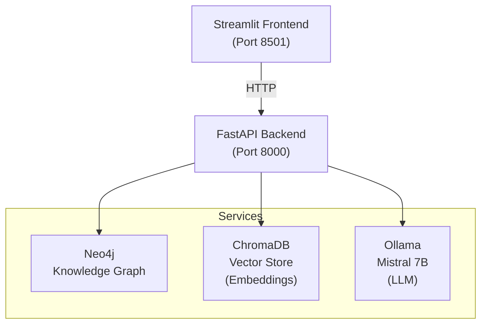

# Industrial Knowledge Brain

AI-powered Industrial Knowledge Intelligence platform for ET AI Hackathon 2026 (Problem Statement 8).

Unifies heterogeneous industrial documents into a queryable knowledge graph with a multi-agent AI copilot for operations, maintenance, compliance, and lessons-learned intelligence.

## Architecture



## Tech Stack

| Component | Technology |
|-----------|-----------|
| Frontend | Streamlit |
| Backend | FastAPI (Python) |
| Knowledge Graph | Neo4j 5 |
| Vector Store | ChromaDB |
| LLM | Ollama + Mistral 7B |
| Embeddings | all-MiniLM-L6-v2 |
| Agent Framework | LangGraph |
| Document OCR | EasyOCR |

## Quick Start

### Prerequisites
- Docker Desktop (with Linux containers)
- 8GB+ RAM allocated to Docker

### Run

```bash
cd industrial-knowledge-brain
docker compose up --build
```

Wait for all services to start (2-5 min for first run - model download).

### Access
- **Frontend:** http://localhost:8501
- **Neo4j Browser:** http://localhost:7474 (neo4j/password)
- **Backend API:** http://localhost:8000/docs

### Auto-Ingest Sample Data

After services are running:

```bash
docker compose exec backend python ingest_sample_data.py
```

This loads sample SOPs, maintenance records, incident reports, and regulatory checklists into the knowledge graph.

## Project Structure

```
├── backend/
│   ├── app/
│   │   ├── main.py              # FastAPI entry
│   │   ├── config.py            # Settings
│   │   ├── core/                # Document processing, OCR, entity extraction
│   │   ├── knowledge_graph/     # Neo4j models, builder, queries
│   │   ├── rag/                 # Embeddings, vector store, retriever, copilot
│   │   ├── agents/              # LangGraph orchestrator + specialist agents
│   │   ├── api/                 # REST endpoints
│   │   └── models/              # Pydantic schemas
│   ├── Dockerfile
│   ├── requirements.txt
│   └── ingest_sample_data.py
├── frontend/
│   ├── app.py                   # Streamlit multi-page app
│   └── Dockerfile
├── data/
│   └── sample_docs/             # Sample industrial documents
├── docker-compose.yml
└── README.md
```

## Demo Walkthrough

1. **Dashboard** - View knowledge graph statistics and coverage
2. **Upload** - Ingest documents (PDF, CSV, images, text)
3. **Knowledge Graph** - Explore entities and relationships
4. **AI Copilot** - Chat with multi-agent system:
   - *"What is the procedure for Pump P-101?"*
   - *"Analyze maintenance history for Pump P-102"*
   - *"Check compliance with OISD standards"*
   - *"Show patterns in near-miss incidents"*
5. **Maintenance** - Predictive analysis and root cause
6. **Compliance** - Regulatory gap analysis

## API Endpoints

| Method | Path | Description |
|--------|------|-------------|
| POST | /api/documents/upload | Upload and process document |
| GET | /api/documents/ | List ingested documents |
| POST | /api/query/chat | Chat with AI copilot |
| GET | /api/knowledge-graph/summary | Graph statistics |
| GET | /api/knowledge-graph/search?q= | Search graph nodes |
| GET | /api/knowledge-graph/explore | Explore subgraph |
| POST | /api/compliance/check | Run compliance check |
| POST | /api/maintenance/predict | Predictive maintenance |
| POST | /api/maintenance/rca | Root cause analysis |

## Built for

ET AI Hackathon 2026
